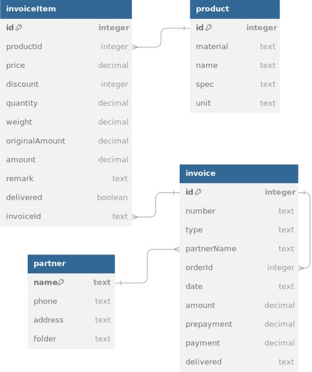

# Table of Contents

- [简介](#简介)
- [特性](#特性)
- [数据库](#数据库)

---

# 简介
这是一个为清单管理而设计的Electron桌面应用，前端使用React.js，后端使用Node.js服务器和SQLite数据库。


# 特性
- [API](API_zh_CN.md)


# 数据库
使用SQLite3数据库存储数据，数据库文件名为`sales.db`。




以下是绘制数据库关系图的DBML源代码。（网站：https://dbdiagram.io）
```
Table product {
  id integer [primary key]
  material text
  name text
  spec text
  unit text
}

Table partner {
  name text [primary key]
  phone text
  address text
  folder text
}

Table invoiceItem {
  id integer [primary key]
  productId integer
  price decimal
  discount integer
  quantity decimal
  weight decimal
  originalAmount decimal
  amount decimal
  remark text
  delivered boolean
  invoiceId text
}

Table invoice {
  id integer [primary key]
  number text
  type text
  partnerName text
  orderId integer
  date text
  amount decimal
  prepayment decimal
  payment decimal
  delivered text
}

Ref: invoiceItem.productId > product.id
Ref: invoice.partnerName > partner.name
Ref: invoiceItem.invoiceId > invoice.id
Ref: invoice.orderId > invoice.id
```