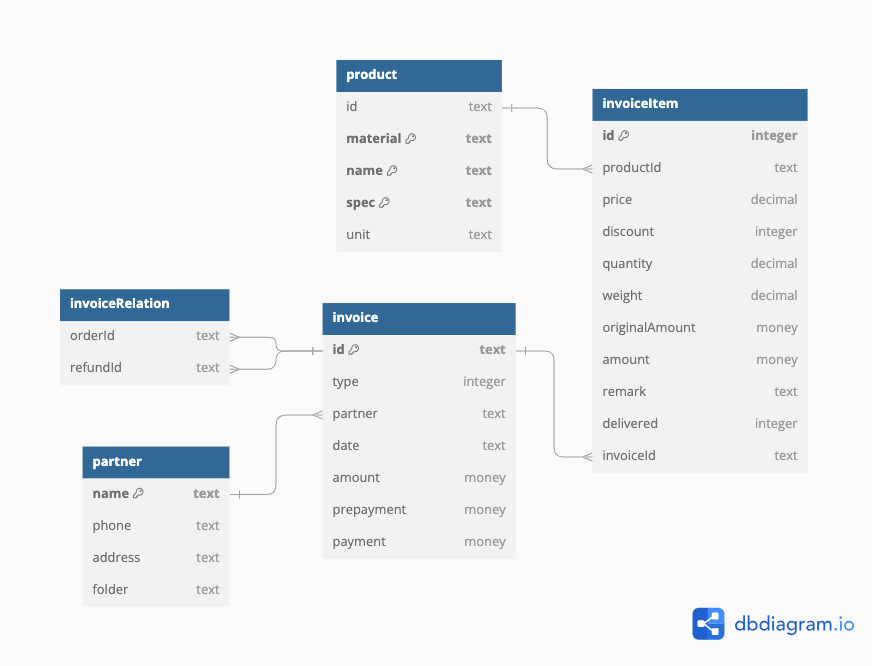

# Table of Contents

- [简介](#简介)
- [特性](#特性)
- [数据库](#数据库)
    - [图表](#图表)
- [Todo list](#todo-list)
    - [产品重量](#产品重量)

---

# 简介
This is an Electron application for sales management, implemented by React.js, Node.js (server) and SQLite.

# 特性
- [API](API_zh_CN.md)

# 数据库
Use sqlite3 database to store data in a single file `sales.db`.

## 图表

Following is the source code in DBML (Database Markup Language) to draw the database diagram. (Website: https://dbdiagram.io)

# Todo list

## 产品重量
- 当前产品数据库不储存重量一项，获取产品时根据过往项目计算重量平均值
- 预计支持产品保存unitWeight作为优先项